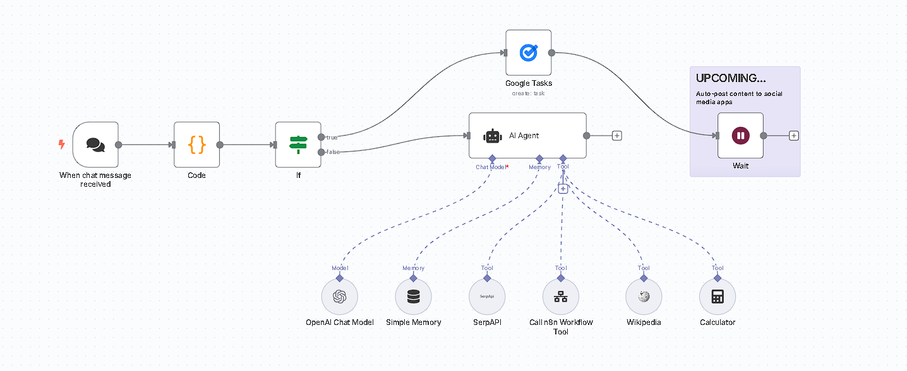
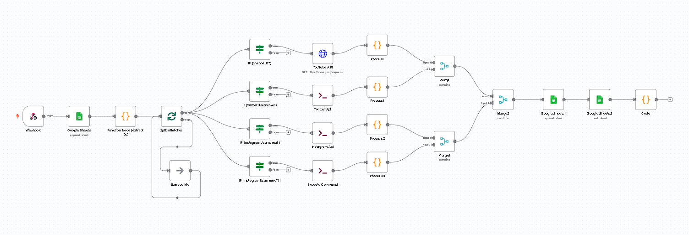

# ragnet-media-orchestrator

An **AI-powered, event-driven content automation system** built with **n8n, OpenAI GPT-4o, SERP API**, and **Puppeteer**.  
This modular pipeline enables automated content extraction, trend-aware generation, and AI-assisted publishing for personal branding and social growth.

> 🚀 "From scraping social data to publishing AI-generated content — all automated and intelligent."

---

## ✨ Features

- 🔄 Multi-platform social data ingestion (Instagram, X/Twitter, Facebook, YouTube)
- 🧠 Retrieval-Augmented Generation (RAG) using OpenAI + SERP API
- 💬 Natural language interface for content requests
- ✅ Human-in-the-loop content approval system
- 📆 Auto-scheduling via Google Calendar and Gmail
- 🧩 Modular, scalable architecture (no-code/low-code via n8n)

---

## 🧭 Architecture Overview

Here’s a visual breakdown of the key workflows in the system:

### 🔹 RAGnet: Content Intelligence Mesh (Main Workflow)



### 🔹 Social Metadata Pipeline



---

## 🛠️ How It Works

### 🔹 Social Metadata Pipeline
- Uses **Puppeteer** + APIs to scrape social media data from:
  - **YouTube:** Channel title, video titles, thumbnails
  - **Twitter/X:** Username, bio, recent tweets
  - **Instagram:** Handle, bio, recent posts
  - **Facebook:** Page bio, about section
- Data is normalized and stored in **Google Sheets**

### 🔹 RAGnet: Content Intelligence Mesh
- Loads metadata from **Google Sheets**
- Prompts **GPT-4o** using **LangChain** with dynamic context injection
- Suggests content ideas based on platform history
- Keyword-enriched via **SERP API** search intelligence
- Provides **Accept/Revise** interaction workflow
- Approved content is pushed to **Google Calendar**
- Integrated with **Gmail** for sending notifications

---

## 💡 Use Cases
- Personal brand managers
- Solo creators or influencers
- Content marketing teams
- Digital agencies scaling multi-platform publishing

---

## 🚀 Getting Started

### 🔧 Prerequisites
- n8n installed (self-hosted or cloud)
- Node.js for running Puppeteer scripts
- Google account for Sheets + Calendar
- API keys:
  - OpenAI
  - SERP API
  - Google Sheets & Calendar (via n8n credentials)

### 📦 Setup

1. **Clone Repository**

   ```bash
   git clone https://github.com/yourusername/ragnet-n8n-workflows.git
   cd ragnet-n8n-workflows

2. **Install Dependencies for Scrapers**

    ```bash
    cd scrapers/
    npm install puppeteer

3. **Run Login Scripts for Cookies**

    ```bash
    node auth/login-and-save-ig-cookies.js
    node auth/login-and-save-fb-cookies.js
    node auth/login-and-save-x-cookies.js
    
   > 💡 This stores cookies locally to prevent repeated login blocks during scraping.

4. **Import Workflows to n8n**

    - Open n8n
    - Go to Workflows → Import
    - Upload the following JSON files:
      - Social Metadata Pipeline.json
      - RAGnet Content Intelligence Mesh.json

5. **Configure Credentials in n8n**

    - OpenAI API key
    - SERP API key
    - Google Sheets & Google Calendar integrations

---

## 🧱 Built With

- [n8n](https://n8n.io/) – Workflow automation
- [OpenAI GPT-4o](https://openai.com/api/) – AI model for content generation
- [LangChain](https://www.langchain.com/) – Framework for context-aware prompting
- [SERP API](https://serpapi.com/) – Google Search API for keyword intelligence
- [Puppeteer](https://pptr.dev/) – Headless browser for web scraping
- [Google Sheets API](https://developers.google.com/sheets/api) – For metadata storage
- [Google Calendar API](https://developers.google.com/calendar) – For scheduling content

---

## 🔗 Connect

Built by M Muntazer Mehdi <br>
Let’s connect on [www.linkedin.com/in/m-muntazer-mehdi](https://www.linkedin.com/in/m-muntazer-mehdi/)

